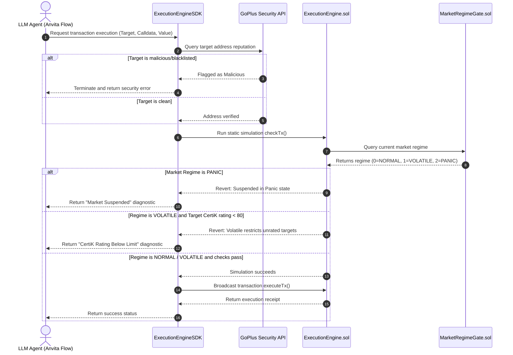

# Pharos Volatility Sentinel and Market Regime Gate

Pharos Volatility Sentinel is a transaction safety and market regime enforcement middleware designed for autonomous AI agents operating on the Pharos Network. It integrates real-time security checking, dynamic slippage control, on-chain market regime state gates, and detailed revert diagnostics to protect AI agent assets during execution.

## The Problem

Autonomous AI agents execute complex multi-step transaction graphs without direct human intervention. This autonomy introduces three major vulnerabilities:

1. **Malicious Protocol Targeting**: Agents can be manipulated via phishing addresses, malicious contract injection, or compromised pool interactions, leading to complete wallet drains.
2. **Execution Volatility and Liquidity Shocks**: During extreme market stress, transaction slippage can spike, leading to sandwich attacks, frontrunning, or executing trades under unfavorable pricing.
3. **Unactionable Execution Failures**: When a smart contract transaction reverts, it returns a raw hexadecimal byte string (e.g., `0x08c379a0...`). LLM agents cannot interpret these raw byte strings, causing execution loops to stall and wasting transaction gas without resolving the root cause.

## The Solution

Pharos Volatility Sentinel resolves these execution risks by acting as an inline security and policy interceptor (middleware):

1. **Pre-flight Security Screening**: Before broadcasting, the SDK queries threat intelligence databases (GoPlus Security API) to verify contract reputations and score security limits.
2. **On-chain Volatility Guarding (Gate 7)**: Protects agents by locking out or restricting transaction routes when the network regime updates. Under volatile states, transactions are limited to certified protocols (CertiK score >80); under panic states, transactions are suspended.
3. **Atomic Multicalls**: Replaces sequential, vulnerable transaction steps (Approve, Swap, Stake) with single atomic multicalls that succeed or fail as a single unit, eliminating MEV frontrunning.
4. **Actionable Revert Diagnostics**: Intercepts reverts, decodes hexadecimal return data, and returns structured human-readable errors (e.g., "Transaction failed due to 3% slippage, suggest adjusting slippage threshold to 3.5%") allowing LLM agents to self-correct and proceed.

## Architecture Diagram

The diagram below outlines the components and execution boundaries between the AI Agent, off-chain security middleware, and on-chain security gates:

```mermaid
graph TD
    subgraph Agent Loop
        A[LLM Agent / Anvita Flow] -->|1. Request Tx| B[ExecutionEngineSDK]
    end

    subgraph Off-chain Middleware
        B -->|2. Check Security| C[GoPlus API]
        B -->|3. Decode Reverts| D[RevertDiagnose Module]
    end

    subgraph On-chain Gates (Pharos Atlantic Testnet)
        B -->|4. Static simulation checkTx| E[ExecutionEngine.sol]
        E -->|Check whitelist/blacklist| F[ProtocolRegistry.sol]
        E -->|Check slippage limits| G[SlippageGuard.sol]
        E -->|Query current state| H[MarketRegimeGate.sol]
    end

    E -->|5. Atomic Broadcast executeTx| E
```

## Operational Flow

The following sequence diagram details the transactional flow and safety checks executed during an agent trade request:



## Partner Integrations

* **GoPlus Security (Address Security API)**: Integrates before transaction broadcasts to intercept blacklisted cybercrime, phishing, and drainer addresses.
* **CertiK (Security Score Integration)**: Restricts AI transactions during VOLATILE state to protocols with a SkyNet security score of >80.
* **Anvita Flow (Execution Flow Middleware)**: Connects with execution graphs to provide RevertDiagnose diagnostics, enabling LLMs to self-correct and execute alternative paths.
* **Alibaba Cloud (Serverless Hosting)**: Microservices, cron jobs, and MCP servers are configured to run serverless on Alibaba Cloud Function Compute.

## Smart Contract Deployments

Deployed on the Pharos Atlantic Testnet (Chain ID 688689):

* **ProtocolRegistry**: `0xbe713906E4D5ac544C069Cd16B2233C979b8AB5a`
* **SlippageGuard**: `0xdeB9B625e70E38cdb0dEe5DEAACa25A5095D512E`
* **MarketRegimeGate**: `0xECF86Cf42d27582FDcc60Eed65F0bB7567c789CF`
* **ExecutionEngine**: `0x8A3e25CbB9e07B122fFBD8718eAD597E0dCCF8f4`

## Getting Started

### Prerequisites

* Node.js (v18 or higher)
* Foundry (for compiling and testing Solidity smart contracts)

### Installation

Clone the repository and install dependencies:

```bash
npm install
```

### Smart Contract Verification

Compile and run smart contract unit tests using Foundry:

```bash
forge build
forge test
```

### Running the Web Dashboard

Start the local development server to view the Three.js WebGL shield and agent visualizations:

```bash
npm run demo-web
```

Open your browser and navigate to `http://localhost:8080`.

### Running CLI Commands

Use the local CLI to query and set values:

```bash
# Query the current on-chain market regime
node bin/cli.js check-regime

# Force set the market regime (owner only)
node bin/cli.js set-regime --value 1
```

### Starting the MCP Server

Start the Model Context Protocol server for agent integrations:

```bash
node bin/mcp-server.js
```

## Visualization Engines

The dashboard features custom graphics engines to represent system state:

* **Gate 7 WebGL Shield**: Runs on Three.js. Standard green particle rotation for NORMAL mode, orange 2.5x speed rotation for VOLATILE mode, and red 6.0x speed rotation for PANIC mode.
* **DeFi Yield Radar (2D Canvas)**: Renders a 5-axes radar web representing target protocol stats. Dynamically pulses and contracts to represent diminished performance or safety during volatile market regimes.
* **Arbitrage Dual-Line (2D Canvas)**: Renders sine waves representing DEX/CEX price spreads and highlights arbitrage windows with shaded profit bands.
* **Generative Scam Dendrite (2D Canvas)**: Uses a recursive branching algorithm to simulate malicious drainer contract interactions.

## License

This project is licensed under the Apache-2.0 License.
