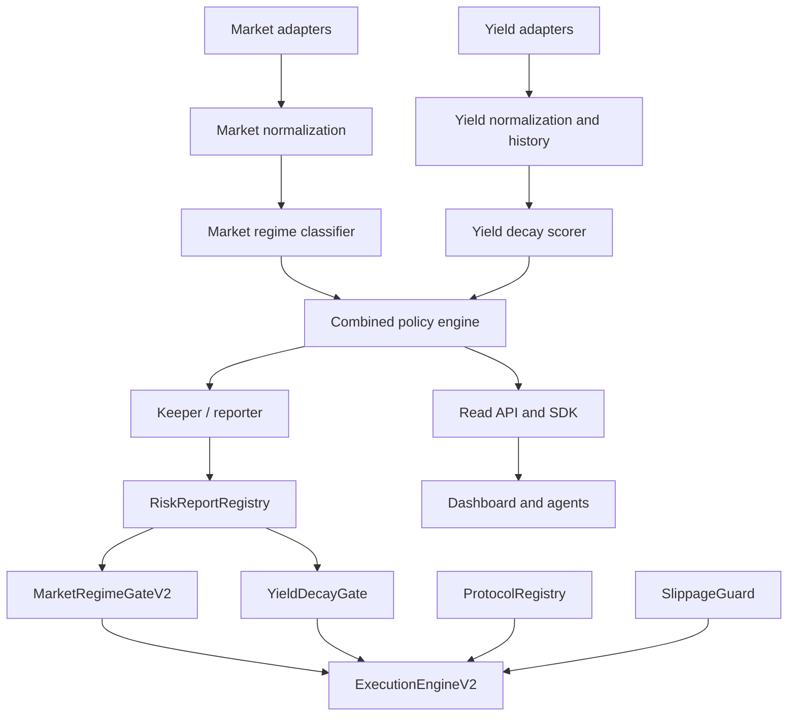

# Architecture

Market risk asks whether the environment is safe. Yield quality asks whether a specific opportunity is sustainable. Protocol security asks whether the target is trusted. Execution risk checks calldata, size, route, and slippage.

Reports are signed, time-bounded, confidence-scored, and sequence-protected. Contracts remain immutable; V2 deploys to new addresses.
